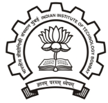

 \
**Rana Das** 22B0738**Civil Engineering B.Tech**
Indian Institute of Technology Bombay

Pursuing a **Major degree** of B.Tech in **Civil Engineering** at *Department of Civil Engineering, IITB* Scholastic Achievements 

- Secured top **3 Percent** Ranking in **JEE Advanced** out of **0.16 million** aspirants [2022]
- Attained a percentile of **99.198** in **JEE Mains** among **1.02 million** candidates [2022]
- Scored **92 Percent** in **All India Senior School Certificate Examination** [2021]
- Scored **95.6 Percent** in **All India Secondary School Examination** [2019]
- Cracked National Talent Search Examination [2019]
- Secured NCO International Rank 10 and Zonal Rank 3 [2019]
- Scored **293/390** in **Birla Institute of Technology and Science Admission Test** [2022]

Key Projects 

**The Humanoid Project** [Nov’23-Present] Computer-Vision Developer | THP @ IITB

- Developed and optimized **computer vision algorithms** to enhance the perception capabilities of humanoid robots, with a focus on the **NVIDIA Jetson** platform.
- Implemented object detection and classification using **Ultralytics** and **YOLO** , focusing on efficiency and performance in **resource-constrained environments** .
- Utilized **OpenCV** for image processing tasks, optimizing algorithms for **real-time** operation.
- Integrated **LLMS** for efficient multimedia processing on Linux-based robotic platforms.
- Collaborated with **cross-functional teams** to integrate AI/ML models into the robot’s perception system, ensuring seamless operation across hardware configurations.
- Successfully ported and **optimized the vision stack** to work efficiently on embedded platforms, enabling real-time perception in diverse environments.
- Leveraged **TensorRT** and **ONNX** on the NVIDIA Jetson platform to **accelerate inference and optimize neural network models** for real-time vision perception.

**Collide Physics Engine** [July’23-Aug”23] Self Project

- Project involving **Game Engine Development** and **Physics Simulation** of rigid body collision.
- Learnt to use **SDL2** Library for C++ and had hands on experience with **Object Oriented Programming** .
- Implementation of keyboard and mouse inputs using SDL2 header files in the script.

**Data Analysis Project** [July’23-Aug’23] Course Project | Course : AI/DS [CE235]

- **Data analysis and regression fitting** of real world data to **predict concrete strength** and effect of factors.
- **Data analysis and regression fitting** of real world data to **predict builtup space** and effect of factors.
- Implementation of Linear, Logistical Regression. Development of Decision Tress and optimization using Random Forest method, Ada-Boosting method, pre-pruning and Bagging.

**Password-Manager Tool** [May’22] Self Project

- Simple Password Management tool written in cpp using crypto++ and *boost* − *iostream* Libraries.
- Use of **Hashing** to keep saved password encrypted using **SHA-3 (384/512), SHAKE (128/256)** .
- **Local storage** of encrypted save files using fileIO methods.

**Robotics Project** [May’23 - Aug’23] Course Project | Course : Makerspace [MS101]

- Worked in a team of 6 and Lead them to build a **Autonomous Line Following Bot from scratch.**
- Bot capable of **Climbing Steep Slopes** while carrying load and able to dump in designated place.
- Used **Arduino, IR-Sensors, ADXL345 Accelerometer and Motor Driver** in the electric circuit.
- Designed **Variable Transmission** to tackle steep slopes using **3D printed planetary gears** , Speed and Power can be controlled by RPM control of Ring and Sun Gears using Arduino PWM control signals.
- Designed **Differential Steering of Frontal Wheels** for the Bot with ability for 25 degree of Deflection.
- Developed the CAD of the bot’s chassis, wheels, clamps, shaft and gears on **Solidworks** and **Fusion 360** .
- Programmed the bot in **Arduino IDE** with AFmotor and Servo library and coded logic for slope detection with ADXL345 accelerometer and corresponding motor RPM for climbing up the slopes.

**Python+SQL Interactive DBMS** [Oct’2021-Nov’2021] Self Project

- Worked on a project involving **MySQL** , **Python Connector** and **Advanced Python Methods** .
- Implementation of **CRUD** (create, retrieve, update and delete) functionality in the script.
- **Lightweight script** runs in shell and have ability to connect to **remote MySQL servers** over Internet.
- Learnt to use connectors and manipulate data, specially large data-sets using advanced python methods.
- **Data Visualization and Analysis** methods in the script for comparison between parameters in data.

Technical Skills 

- **Programming Languages:** Python | C++ | C | SourcePawn
- **Software:** Fusion360 | LATEX| MATLAB | Onshape | Arduino IDE
- **Database Management Tools:** mySQL | PostgreSQL
- **Python Libraries:** Ultralytics | Tensorflow | pytorch | ONNX | TensorRT | OpenCV
- **Cloud Tech.** : AWS | GCP | Azure | OpenVPN | nginx | apache2
- **Content Creation** : Adobe Premier Pro | Adobe After Effects | Adobe Photoshop | DaVinci Resolve
- **Misc. :** git | GitHub | Canva | NetData | OpenSSH | FileZilla/winSCP/SFTP

Key Courses Undertaken 

- **Machine Learning :** Artificial Intelligence and DataScience in Civil Engineering.
- **Data Science :** Data Science: Machine Learning *by HarvardX*
- **Math :** Calculus | Linear Algebra | Partial Differential Equations.
- **Computer Science :**

  Computer Programming and Utilization

  CS50’s Introduction to Programming with Python *by HarvardX* Python for Data Science *by UCSanDiegoX*

  IBM: Introduction to Cloud Computing

  OpenCV Bootcamp for Computer-Vision and Image Processing

- **Entrepreneurship and Philosophy :**

  Introduction to Entrepreneurship | Introduction to Philosophy | Economics

Extra-Curricular Activities 

- Developed a **Business Model Canvas** and **Startup Plan** for an **Ed-Tech Startup ”Chamka”** for **EnBuzz** Competition conducted by E-Cell with initial investment requirements and expected revenue modelled on different level of forecast-ed market response. [Nov’22-Dec’22]
- Played **Rugby** and **Flag-Football** competitively, was **one time District Champion** and was dubbed **best Defender** . [2017-2020]
- Competed in **Google Code to Learn** Contest and was best in District with **overall rank of 110** alongside my partner and received newspaper coverage for the same. [2018]
- Cleared Stage 1 of NSEP, NSEC, NSEJS, NSEA, IMO conducted by IAPT [2018-2021]
- Cracked Stage 2 of NSEC, NSEA conducted by IAPT [2018-2021]
- Multiple Time SOF NSO, SOF IMO, SOF IEO, SOF NCO gold-medalist [2018-2020]
- Participated in UL NSSC Zonal Convention [2018]
- STSE National Rank 3 [2018]
